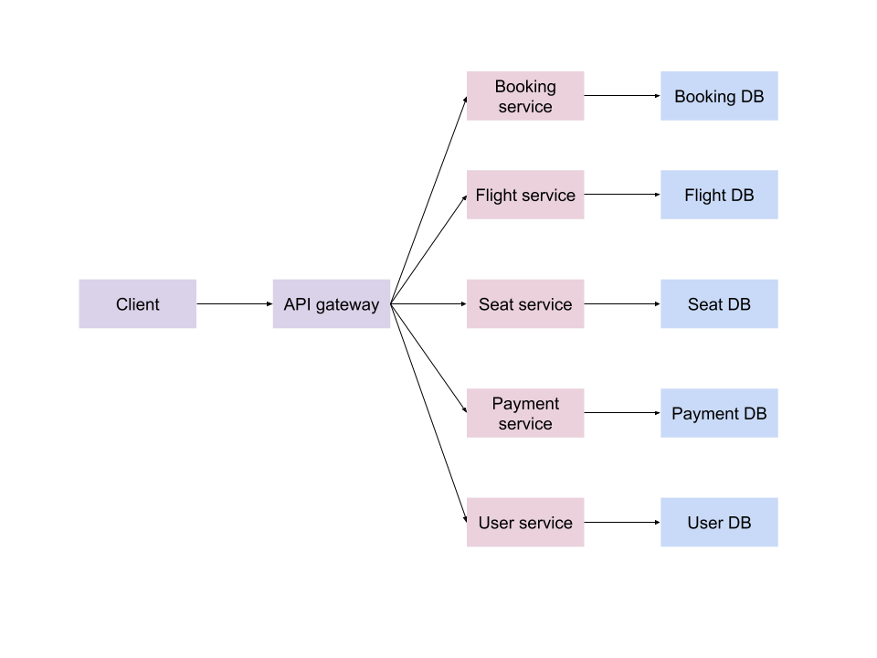

# [Airline Reservation System](https://rodrigobdz.github.io/airline-reservation-system)

Airline reservation system using microservices.

## Usage

- Install dependencies in all subdirectories.

  ```sh
  yarn install-all
  ```

- Start API gateway server and servers for microservices.

  ```sh
  yarn start
  ```

- Run all tests.

  ```sh
  yarn test
  ```

## Built with

- [node.js](https://nodejs.org/) - Server runtime environment
- [nodemon](https://nodemon.io/) - Restart automatically on changes in development
- [hapi](https://hapijs.com/) - Server framework for node.js
- [mongoose](https://mongoosejs.com/) - node.js object modeling for MongoDB
- [AVA](https://github.com/avajs/ava) - JS test runner

## Architecture



## Progress

This is a WIP. Check [projects](https://github.com/rodrigobdz/airline-reservation-system/projects/1) for more details.

## Contributing

If you find a bug, please create an [issue](https://github.com/rodrigobdz/airline-reservation-system/issues) or a [PR](https://github.com/rodrigobdz/airline-reservation-system/pulls).

## License

[MIT](LICENSE) © [rodrigobdz](https://rodrigobdz.github.io/).
